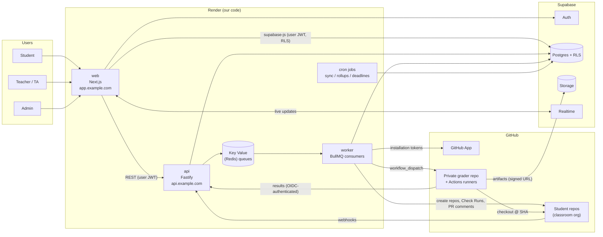
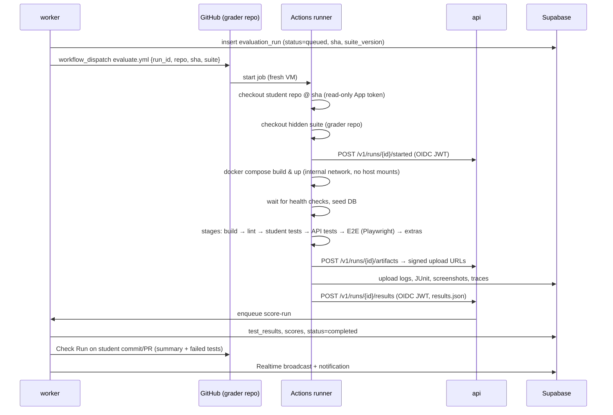

# Architecture

This document describes the target architecture for the Full-Stack Project Evaluation &
Management Platform. Read it with [REQUIREMENTS.md](./REQUIREMENTS.md) (what it must do),
[DATA_MODEL.md](./DATA_MODEL.md) (the schema) and [ROADMAP.md](./ROADMAP.md) (build order).

---

## 1. Guiding decisions

| # | Decision | Why |
|---|----------|-----|
| D1 | **TypeScript end to end, in a pnpm + Turborepo monorepo** | One language for UI, API, worker and test harness; shared types and Zod schemas. |
| D2 | **Supabase is the system of record**: Postgres, Auth, Storage, Realtime | Requested; Row Level Security (RLS) gives defence in depth for multi-role access. |
| D3 | **Render hosts our code only**: web app, API, worker, cron jobs, Key Value (Redis) | Requested; Render does not allow privileged Docker, so it must *not* run student code. |
| D4 | **Student code runs on GitHub Actions runners, never on our servers** | Untrusted code needs throwaway isolated machines. Hosted runners give that at no ops cost; self-hosted ephemeral runners are the scale-up path. |
| D5 | **Integrate through a GitHub App, not an OAuth App or PATs** | Fine-grained per-repo permissions, installation tokens that expire, webhooks, Check Runs, higher rate limits. |
| D6 | **Webhook-first, async-by-default** | Webhooks are acknowledged in under a second and queued; all heavy work happens in the worker. Polling is only for reconciliation. |
| D7 | **SQL migrations (Supabase CLI) are the schema source of truth** | Reviewed, versioned, applied by CI; TS types are generated from the database. |

---

## 2. System context



### Components

| Component | Tech | Render type | Responsibility |
|-----------|------|-------------|----------------|
| **web** | Next.js (App Router), React, Tailwind, shadcn/ui, TanStack Query, `@supabase/ssr` | Web Service | All UIs (student, teacher, admin); simple RLS-protected reads straight from Supabase; calls `api` for privileged operations. |
| **api** | Fastify, Zod, `@octokit/app`, `jose` | Web Service (always on) | GitHub webhook receiver, privileged REST API, results callback from grader, signed upload URLs. Stateless; scales horizontally. |
| **worker** | Node + BullMQ | Background Worker | Webhook processing, repo provisioning, evaluation orchestration, scoring, Check Runs / PR comments, notifications, email. |
| **cron** | Node scripts | Cron Jobs | GitHub reconciliation sync, deadline cut-offs, metric rollups, stale-run reaper, retention cleanup. |
| **Key Value** | Redis-compatible | Render Key Value | BullMQ queues, rate-limit counters, short-lived caches. Not a system of record. |
| **Supabase** | Postgres 15+, Auth, Storage, Realtime | Managed | Data, identity, artifacts (logs, screenshots, Playwright traces), live dashboard updates. |
| **grader** | Private GitHub repo with reusable workflows, hidden tests, Docker Compose harness, Playwright | GitHub Actions | Builds and runs each submission in isolation and reports structured results. |

> **Why a separate `api` when Next.js has route handlers?** Webhooks and grader callbacks must be
> always on, fast, and independent of UI deploys; long-running GitHub calls should not share a
> process with page rendering. If you want fewer services for the MVP, the `api` routes can start
> inside Next.js and be extracted later. Keep them in a separate package (`packages/core`) from
> day one so the move is mechanical.

---

## 3. Monorepo layout

```
hbe-project-code/
├── apps/
│   ├── web/                 # Next.js app (student / teacher / admin portals)
│   ├── api/                 # Fastify: REST, webhooks, grader callbacks
│   ├── worker/              # BullMQ job processors
│   └── cron/                # Entry points for Render Cron Jobs
├── packages/
│   ├── core/                # Domain logic: scoring, policies, permissions (pure TS, unit-tested)
│   ├── db/                  # Generated Supabase types, query helpers (Kysely), repositories
│   ├── github/              # GitHub App client, webhook schemas, token cache, rate-limit handling
│   ├── contracts/           # Zod schemas shared by api/web/worker/grader (API DTOs, result payloads)
│   ├── ui/                  # Shared React components
│   └── config/              # eslint, tsconfig, tailwind presets
├── supabase/
│   ├── migrations/          # SQL migrations (source of truth)
│   ├── seed.sql             # Local/dev seed data
│   └── config.toml          # Local Supabase stack config
├── grader/                  # Mirrored/published to the private grader repo
│   ├── .github/workflows/evaluate.yml
│   ├── harness/             # compose overrides, wait-for-health, result collector
│   └── suites/<assignment>/ # Hidden API + E2E tests per assignment, versioned
├── templates/               # Starter repos per assignment (runtime contract baked in)
├── docs/
├── render.yaml              # Render Blueprint (all services + env groups)
└── turbo.json / pnpm-workspace.yaml
```

---

## 4. Identity, roles and authorisation

### 4.1 Authentication (Supabase Auth)

| User type | Sign-in methods | Notes |
|-----------|-----------------|-------|
| Student | **GitHub OAuth** (required), email magic link as fallback | GitHub login links the platform user to a GitHub user id, which is how commits/PRs are attributed. |
| Teacher / TA | Google / Microsoft SSO or email + password, optional GitHub link | Link GitHub if they review in GitHub. |
| Admin | Same as teacher, **MFA (TOTP) required** | Enforced via `aal2` check in RLS and API. |

- Use the **GitHub App's own client ID/secret** as Supabase's GitHub provider so a single app
  handles both login and repository access.
- Store `github_user_id` (numeric, immutable) as the identity key, never the username (users
  can rename themselves).
- Configure custom SMTP (e.g. Resend, Postmark, SES). The built-in Supabase mailer is
  rate-limited and not meant for production.

### 4.2 Role model

Two layers:

1. **Platform role**: `admin | teacher | student`, in `user_roles`. Controls admin panel
   access and who may create courses.
2. **Course role**: `instructor | ta | student`, in `course_memberships`. Controls what a user
   can see and do *within a course*. A teacher is only an instructor in the courses they're
   assigned to.

A **Custom Access Token Hook** (Postgres function) puts `platform_role` into the JWT, so the UI
and API can gate routes without an extra query. Per-course checks always go to the database,
because they change too often to cache in a token.

### 4.3 Enforcement layers

1. **UI**: hides what the user can't do (convenience only).
2. **API**: verifies the Supabase JWT (JWKS / asymmetric signing keys), then runs
   `packages/core/permissions` checks (`can(user, 'grade', submission)`).
3. **Database RLS**: every table that holds user data has RLS enabled. Helper functions such as
   `is_course_staff(course_id)` and `is_course_member(course_id)` are `SECURITY DEFINER` and `STABLE`.
4. **Service role key**: used only by `api`/`worker`/`cron`, never shipped to the browser.
   These services must call the permission layer explicitly, because the service role bypasses RLS.

---

## 5. GitHub integration

### 5.1 GitHub App configuration

| Setting | Value |
|---------|-------|
| Installed on | The classroom GitHub organisation(s), e.g. `hbe-classroom-2026` |
| Repository permissions | Contents: **read**; Metadata: read; Pull requests: **read & write** (review comments); Issues: **read & write**; Checks: **read & write**; Actions: **read & write** (only needed on the grader repo); Administration: **write** (create repos from templates, add collaborators); Commit statuses: read |
| Organisation permissions | Members: read |
| Webhook events | `push`, `pull_request`, `pull_request_review`, `pull_request_review_comment`, `issues`, `issue_comment`, `create`, `delete`, `repository`, `installation`, `installation_repositories`, `workflow_run`, `check_suite` |
| Webhook URL | `https://api.example.com/webhooks/github` |
| Callback URL | Supabase Auth callback (`https://<project>.supabase.co/auth/v1/callback` or the custom auth domain) |

### 5.2 Repository provisioning (recommended mode)

When a teacher **publishes** an assignment:

1. The worker creates one repo per student (or per team) from the assignment's **template repo**
   (`POST /repos/{template_owner}/{template_repo}/generate`), named
   `{assignment-slug}-{github-login}`, and makes it private.
2. It adds the student(s) as collaborators with `push` access and the course staff team with
   `maintain` access.
3. It applies a **branch ruleset** on `main` (require PR, block force-push) if the assignment
   grades PR workflow.
4. It records the repo in `repositories` and links it to the `submission`.

*Bring-your-own-repo* mode is also supported: the student installs the App on their own repo
and the platform links it. Use this for capstones; provisioning is the default for consistency.

### 5.3 Webhook ingestion pipeline

```
GitHub ──POST──▶ api /webhooks/github
                 1. Verify X-Hub-Signature-256 (HMAC-SHA256, constant-time compare)
                 2. INSERT github_events (delivery_id UNIQUE) ── duplicate? → 200, stop
                 3. Enqueue job {event_id} on queue "github-events"
                 4. Return 202 (target: under 200 ms; GitHub times out after 10 s)
worker  ──────▶  5. Load raw payload, normalise by event type:
                    push          → upsert commits (author mapping, stats via API when needed)
                    pull_request  → upsert pull_requests; maybe trigger evaluation
                    issues/...    → upsert issues / comments
                    workflow_run  → reconcile evaluation_run status
                 6. Map github_user_id → profile; unmatched authors are kept and flagged
                 7. Apply the assignment's evaluation trigger policy (§6.2)
                 8. Emit Realtime update / notification
```

- **Idempotency**: `X-GitHub-Delivery` is the dedup key; every normaliser upserts on GitHub's
  node IDs.
- **Missed deliveries**: a cron job runs every 15 minutes. It lists failed deliveries via the App
  API and redelivers them, and every few hours it reconciles recent commits/PRs per active
  repo with conditional (`ETag`) requests.
- **Rate limits**: installation tokens are cached until about 5 minutes before they expire. Every
  response's `x-ratelimit-remaining` is tracked per installation, and the worker backs off when
  it falls below 10%. Use GraphQL to bulk-fetch PR/review data for dashboards.
- **Raw payload retention**: keep 90 days, then prune (normalised rows stay).

### 5.4 Activity metrics

Computed by the worker and rolled up nightly into `activity_daily` per student per assignment:

- commits (count, active days, longest gap, commit-size distribution, % of commits in the final 24 h)
- PRs opened / merged, time-to-merge, review comments received and resolved
- issues opened / closed, linked to PRs
- CI/evaluation pass-rate trend over time

> These numbers are **signals for teachers, not grades by default**. Commit count is easy to
> game and penalises good habits like squashing. Only weight activity in a score when the
> teacher explicitly opts in, and then use bounded measures (e.g. "active on 5 or more distinct days").

---

## 6. Automated evaluation pipeline

### 6.1 The submission runtime contract

Every assignment template defines a contract the student project must honour, so one harness
can test any stack:

```yaml
# .hbe/contract.yaml (in the template, read-only for students via CODEOWNERS)
compose_file: compose.yaml          # must build and run the full stack
services:
  frontend: { port: 3000, health: /       }
  backend:  { port: 4000, health: /health }
database: postgres                  # harness provides it; app reads DATABASE_URL
env_required: [DATABASE_URL, JWT_SECRET]
seed_command: "npm run db:seed --prefix backend"
student_tests: "npm test --prefix backend"   # optional, reported but separately weighted
```

### 6.2 Trigger policies (per assignment)

- `on_push` to the default branch (debounced: newest SHA wins within a 5-minute window)
- `on_pull_request` (opened / synchronize): result posted as a Check Run on the PR
- `manual` (student "Run tests" button; quota per day, e.g. 10)
- `on_deadline`: final graded run on the last commit **before the deadline**, so later pushes
  can't change the graded SHA
- teacher re-run (any SHA, any suite version)

Concurrency guard: at most one active run per (submission, trigger type); per-course and
global concurrency caps keep Actions minutes in check.

### 6.3 Run lifecycle



### 6.4 Grader security

| Threat | Mitigation |
|--------|-----------|
| Student code attacks platform servers | Student code only ever runs on throwaway Actions VMs; Render never executes it. |
| Student reads or exfiltrates hidden tests | Tests run from a separate container; the suite is **not** mounted into student containers. After the build step, student containers run on an `internal: true` Docker network with no internet access. Assume determined students may still infer tests, so design them to be robust to that. |
| Student tampers with grading workflow | The workflow lives in the private grader repo, not the student's repo. Student-repo CI is informational only. |
| Forged results | The results endpoint accepts only a **GitHub Actions OIDC token**. The API checks `iss`, `aud=https://api.example.com`, `repository=<org>/hbe-grader`, `workflow_ref`, `ref=refs/heads/main`, and that the `run_id` matches the dispatched one. There are no long-lived shared secrets. |
| Resource abuse (fork bombs, infinite loops) | Per-stage `timeout-minutes`, a job-level timeout, Docker `--memory`/`--pids-limit`, and log size cap. |
| Secret leakage | The grader job has no platform secrets. Its App token is read-only and scoped to the single student repo (`actions/create-github-app-token` with `repositories:`). |

### 6.5 Results format (`packages/contracts`)

```jsonc
{
  "run_id": "uuid",
  "sha": "abc123",
  "suite_version": "a3-v4",
  "started_at": "...", "finished_at": "...",
  "stages": [
    { "key": "build", "status": "passed", "duration_ms": 81234 },
    { "key": "api",   "status": "failed", "duration_ms": 22011,
      "tests": [ { "id": "auth.login.rejects-bad-password", "status": "failed",
                   "weight": 2, "message": "expected 401, got 500", "artifact": "api/junit.xml" } ] }
  ],
  "infra_error": null      // set when the failure is ours, not the student's → auto-retry, never graded
}
```

### 6.6 Scoring

`final = Σ (component_weight × component_score) − late_penalty`. Components are configured per
assignment:

- **automated**: weighted tests, normalised to 0–100 (test weights live in the suite manifest)
- **rubric**: manual criteria scored by staff (code quality, architecture, UX, docs)
- **process** (optional): bounded activity criteria (§5.4), PR hygiene, issue usage
- **late penalty**: per-day %, cap, grace period, and per-student extensions

Scores are **recomputed, not mutated**: a `grade` row points to the evaluation run and rubric
review it was derived from, and staff overrides are separate rows with a reason, so the result
can always be audited.

### 6.7 Capacity and cost: Actions minutes

Rough guide: `students × runs/week × minutes/run`. For example, 100 × 5 × 6 = 3,000 min/week,
or about 12,000 min/month. Private-repo minutes on GitHub's free and Team plans run out well
below that, so plan one of:

1. Apply for **GitHub Education / GitHub Campus** benefits for the organisation.
2. Run **self-hosted ephemeral runners** (ARC on Kubernetes, or autoscaled VMs with
   `--ephemeral`) labelled `hbe-grader`. This is the main path for scaling up. The workflow only
   changes its `runs-on`.
3. Cap runs per student per day and debounce pushes (§6.2).

---

## 7. Application surfaces

### Student portal
Dashboard (assignments, deadlines, latest scores) · assignment detail (spec, repo link,
contract, run history) · run detail (stage timeline, failed tests, logs, screenshots, trace
viewer link) · feedback inbox · "Run tests" button with remaining quota.

### Teacher portal
Course overview heat-map (students × assignments) · assignment builder (template repo,
suite version, rubric, triggers, weights, deadlines, late policy) · submission review (diff
viewer, run results, inline comments synced to PR review comments, rubric scoring) · activity
analytics · bulk actions (re-run, extend deadline, release grades) · CSV/LMS export.

### Admin panel
Users (invite, bulk CSV import, role changes, deactivate, impersonate in read-only mode with
audit) · courses and staff assignment · GitHub installations and orgs · grader suites and
versions · platform settings (quotas, concurrency caps, retention, email templates, feature
flags) · audit log viewer · system health (queue depth, failed jobs, webhook lag, Actions minutes used).

---

## 8. API surface (`api`, versioned under `/v1`)

| Area | Endpoints (illustrative) | Auth |
|------|--------------------------|------|
| Webhooks | `POST /webhooks/github` | HMAC signature |
| Grader | `POST /v1/runs/:id/started`, `POST /v1/runs/:id/artifacts`, `POST /v1/runs/:id/results` | GitHub OIDC |
| Assignments | `POST /v1/assignments/:id/publish` (provisions repos), `POST /v1/assignments/:id/regrade` | Staff JWT |
| Runs | `POST /v1/submissions/:id/runs` (manual trigger, quota-checked) | Student/staff JWT |
| Feedback | `POST /v1/submissions/:id/feedback` (optionally mirrored to PR review) | Staff JWT |
| Grades | `POST /v1/courses/:id/grades/release`, `GET /v1/courses/:id/grades.csv` | Staff JWT |
| Admin | `/v1/admin/users`, `/v1/admin/settings`, `/v1/admin/installations` | Admin JWT + MFA |
| Health | `GET /healthz` (liveness), `GET /readyz` (DB + Redis) | none |

Plain CRUD reads (lists, dashboards) go straight from `web` to Supabase under RLS. The API
handles anything that needs the service role, GitHub, the queues, or multi-step transactions.
OpenAPI is generated from Zod schemas (`fastify-type-provider-zod`).

---

## 9. Background jobs (BullMQ queues)

| Queue | Jobs | Retries |
|-------|------|---------|
| `github-events` | normalise webhook payloads | 5, exponential backoff |
| `provisioning` | create repo from template, add collaborators, apply rulesets | 5; failures surface on the admin dashboard |
| `evaluations` | dispatch run, score run, publish Check Run | 3; infra errors are auto-retried once |
| `notifications` | in-app + email (Resend/Postmark) | 5 |
| `sync` | reconciliation, redelivery of failed webhooks | 3 |

Cron jobs (Render): `*/15` redeliver failed webhooks · `*/5` reap stale runs (queued for more than 30
minutes or running for more than 45) · `0 * * * *` deadline cut-off and final graded runs · `0 2 * * *` activity rollups ·
`0 3 * * 0` retention cleanup.

---

## 10. Deployment: Render + Supabase + custom domain

### 10.1 Environments

| Env | Supabase | Render | GitHub |
|-----|----------|--------|--------|
| local | `supabase start` (Docker) | `pnpm dev` | Dev GitHub App + test org, webhooks through `smee.io` |
| staging | Separate project | Separate services (Blueprint, `staging` branch) or preview environments | Staging App + staging org |
| production | Separate project (Pro plan: daily backups, PITR add-on) | Production services from `main` | Production App + classroom org(s) |

Never share a Supabase project or GitHub App between environments.

### 10.2 Render Blueprint (outline)

```yaml
# render.yaml
envVarGroups:
  - name: hbe-shared
    envVars:
      - key: SUPABASE_URL
        sync: false
      - key: SUPABASE_SERVICE_ROLE_KEY
        sync: false
      - key: GITHUB_APP_ID
        sync: false
      - key: GITHUB_APP_PRIVATE_KEY
        sync: false
      - key: GITHUB_WEBHOOK_SECRET
        sync: false
services:
  - type: web
    name: hbe-web
    runtime: node
    buildCommand: pnpm install --frozen-lockfile && pnpm turbo build --filter=web
    startCommand: pnpm --filter web start
    healthCheckPath: /api/health
    domains: [app.example.com]
  - type: web
    name: hbe-api
    runtime: node
    buildCommand: pnpm install --frozen-lockfile && pnpm turbo build --filter=api
    startCommand: pnpm --filter api start
    healthCheckPath: /healthz
    domains: [api.example.com]
    envVars:
      - fromGroup: hbe-shared
      - key: REDIS_URL
        fromService: { type: keyvalue, name: hbe-queue, property: connectionString }
  - type: worker
    name: hbe-worker
    runtime: node
    startCommand: pnpm --filter worker start
    envVars:
      - fromGroup: hbe-shared
  - type: cron
    name: hbe-cron-deadlines
    schedule: "0 * * * *"
    startCommand: pnpm --filter cron run deadlines
  - type: keyvalue
    name: hbe-queue
    plan: starter
    maxmemoryPolicy: noeviction      # required for BullMQ
    ipAllowList: []                   # private network only
```

Notes:
- Use a **paid, always-on** instance type for `api`. Free web services spin down when idle,
  which drops webhooks and grader callbacks.
- Turn on Render's **build filters** (`buildFilter.paths`) so a web-only change doesn't redeploy the worker.
- Database migrations run in CI (`supabase db push`) **before** the Render deploy, never from a
  service start command. Keep migrations backwards-compatible (expand, then contract).

### 10.3 Custom domain

| Hostname | Points to | How |
|----------|-----------|-----|
| `example.com` | marketing / redirect to `app.` | Render: apex domain uses an `A`/`ALIAS` record as Render instructs |
| `app.example.com` | `hbe-web` | `CNAME` → `hbe-web.onrender.com` |
| `api.example.com` | `hbe-api` | `CNAME` → `hbe-api.onrender.com` |
| `auth.example.com` (optional) | Supabase | Supabase Custom Domain add-on, so OAuth consent and emails show your brand |

Render issues and renews TLS certificates automatically once DNS checks out. Then update:
Supabase Auth **Site URL** and **Redirect URLs** (`https://app.example.com/**`), the GitHub App
webhook and callback URLs, the OIDC `aud` the API expects, CORS origins in `api`, and the email
templates. Set HSTS once everything is on HTTPS.

### 10.4 CI/CD (GitHub Actions on this repo)

1. PR: lint, typecheck, unit tests (`packages/core` has high coverage), migration lint
   (`supabase db lint`), RLS policy tests (pgTAP), and API integration tests against a local Supabase stack.
2. Merge to `main`: apply migrations to staging, Render auto-deploys staging, run smoke E2E tests.
3. Promote: tag a release, apply migrations to production, then deploy production (Render deploy hook).
4. Grader suites are published to the private grader repo by a workflow, with version tags
   (`suite/a3-v4`). Assignments pin a suite version, so a re-grade is reproducible.

---

## 11. Cross-cutting concerns

- **Observability**: structured JSON logs (pino) with `request_id`, `run_id`, `delivery_id`;
  Sentry for web/api/worker; OpenTelemetry traces exported to Grafana Cloud or Honeycomb;
  BullMQ dashboard (bull-board, admin-only); alerts on webhook lag, queue depth, failed-run
  rate, Actions minutes burn, and Supabase connection saturation.
- **Database connections**: services use Supavisor (transaction mode, port 6543) with small
  pools; the worker uses session mode only where it needs `LISTEN` or advisory locks.
- **Realtime**: subscribe with `postgres_changes` on narrow tables (`evaluation_runs`,
  `notifications`) with RLS; use broadcast channels for high-frequency progress events.
- **Storage**: buckets `run-artifacts` (private, signed URLs, 180-day retention) and `avatars`
  (public). Paths are `course/{course_id}/run/{run_id}/...`, and storage RLS is based on course membership.
- **Audit log**: append-only `audit_logs` for role changes, grade overrides, releases,
  impersonation, settings changes, and deletions.
- **Privacy**: student data is education-record data (FERPA/GDPR/DPDP, depending on region). The
  platform needs data-processing agreements with Supabase/Render/GitHub, export and deletion
  on request, minimal PII, retention limits, and no student data in logs or Sentry breadcrumbs.
- **Accessibility**: WCAG 2.1 AA; keyboard-navigable diff/review UI; colour-blind-safe status colours.
