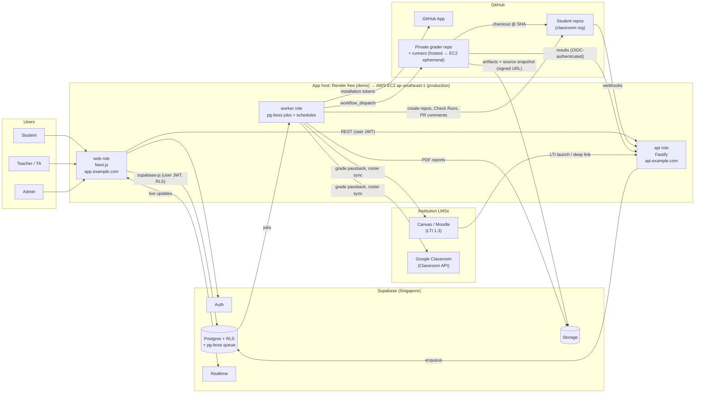

# Architecture

This document describes the target architecture for the Full-Stack Project Evaluation &
Management Platform. Read it with [REQUIREMENTS.md](./REQUIREMENTS.md) (what it must do),
[DATA_MODEL.md](./DATA_MODEL.md) (the schema) and [ROADMAP.md](./ROADMAP.md) (build order).

---

## 1. Guiding decisions

| # | Decision | Why |
|---|----------|-----|
| D1 | **TypeScript end to end, in a pnpm + Turborepo monorepo** | One language for UI, API, worker and test harness; shared types and Zod schemas. |
| D2 | **Supabase is the system of record**: Postgres, Auth, Storage, Realtime | Requested; Row Level Security (RLS) gives defence in depth for multi-role access. |
| D3 | **The app host runs our code only.** That's Render's free tier for the demo, then AWS EC2 (Singapore) in production, with one Docker image for both | Student code is never run on the app host. Using the same container image keeps the move to EC2 to a configuration change. |
| D4 | **Student code runs on GitHub Actions runners, never on our servers** | Untrusted code needs throwaway isolated machines. Hosted runners give that at no ops cost; self-hosted ephemeral runners are the scale-up path. |
| D5 | **Integrate through a GitHub App, not an OAuth App or PATs** | Fine-grained per-repo permissions, installation tokens that expire, webhooks, Check Runs, higher rate limits. |
| D6 | **Webhook-first, async-by-default** | Webhooks are acknowledged in under a second and queued; all heavy work happens in the worker. Polling is only for reconciliation. |
| D7 | **SQL migrations (Supabase CLI) are the schema source of truth** | Reviewed, versioned, applied by CI; TS types are generated from the database. |
| D8 | **Multi-tenant, shared schema**: every tenant-owned row carries `institution_id`, and RLS isolates institutions | Several institutions on one deployment. One schema keeps operations simple, and RLS plus composite foreign keys prevent cross-tenant access (§4). |
| D9 | **The platform is the system of record** for submissions, runs, grades and reports. LMSs receive a copy. | Every submission and grade report must be viewable at any time, even if a GitHub repo or LMS course is later deleted (§12, §13). |
| D10 | **Stack profiles**: an admin-curated catalogue of tech stacks; each project is locked to one | Any stack is allowed, but each project's stack is fixed, so the grader always knows how to build, lint and test it (§6.1). |
| D11 | **Process (activity) is a standard grade component**, computed from capped, gaming-resistant metrics | Activity counts toward grades, so it has to be fair, transparent and explainable (§5.4). |

---

## 2. System context



### Components

The platform's own code ships as **one Docker image** with three **roles**, selected by the
`ROLES` environment variable. On the free tier, all three roles run in one process. On EC2
they run as separate containers that can be scaled independently. The code is identical in
both cases; see [DEPLOYMENT.md](./DEPLOYMENT.md).

| Role / component | Tech | Responsibility |
|------------------|------|----------------|
| **web** | Next.js (App Router), React, Tailwind, shadcn/ui, TanStack Query, `@supabase/ssr` | All UIs (student, teacher, admins); simple RLS-protected reads straight from Supabase; calls the `api` role for privileged operations. |
| **api** | Fastify, Zod, `@octokit/app`, `jose` | GitHub webhook receiver, privileged REST API, grader results callback, LTI endpoints, signed upload URLs. Stateless. |
| **worker** | Node + **pg-boss** | Webhook processing, repo provisioning, evaluation orchestration, scoring, Check Runs / PR comments, grade reports, LMS sync, notifications, email; also runs the **scheduled jobs** (pg-boss cron), so no separate cron service is needed. |
| **Supabase** | Postgres 15+, Auth, Storage, Realtime | Data, identity, job queue (pg-boss schema), artifacts, snapshots, reports, live dashboard updates. |
| **grader** | Private GitHub repo with reusable workflows, hidden tests, Docker Compose harness, Playwright | Builds and runs each submission in isolation, snapshots the graded source, and reports structured results. |

> **Why pg-boss instead of Redis/BullMQ?** At about 100 concurrent students the job volume is
> small. A Postgres-backed queue gives durable, transactional jobs (enqueue in the same
> transaction as the data change) plus cron-style schedules. It needs no Redis, which the free
> tier lacks and which would otherwise be one more thing to run on EC2. The queue sits behind a
> `packages/queue` interface, so switching to BullMQ/SQS later only touches one package.

---

## 3. Monorepo layout

```
hbe-project-code/
├── apps/
│   ├── web/                 # Next.js app (student / teacher / admin portals)
│   └── server/              # Single entry point: Fastify api + pg-boss worker/schedules,
│                            #   and (when ROLES includes web) serves the Next.js handler
├── packages/
│   ├── core/                # Domain logic: scoring, policies, permissions (pure TS, unit-tested)
│   ├── db/                  # Generated Supabase types, query helpers (Kysely), repositories
│   ├── github/              # GitHub App client, webhook schemas, token cache, rate-limit handling
│   ├── queue/               # Queue + schedule interface (pg-boss implementation)
│   ├── settings/            # Typed config loader: plan profile + env, validated at startup
│   ├── contracts/           # Zod schemas shared by api/web/worker/grader (API DTOs, result payloads)
│   ├── lms/                 # LMS adapters: LTI 1.3 (Canvas, Moodle), Google Classroom API
│   ├── reports/             # Grade report rendering (HTML → PDF)
│   ├── ui/                  # Shared React components
│   └── config/              # eslint, tsconfig, tailwind presets
├── config/
│   ├── profiles/            # free.yaml / paid.yaml plan profiles (limits, behaviour)
│   └── env/                 # *.env.example per environment (local, demo, production)
├── supabase/
│   ├── migrations/          # SQL migrations (source of truth)
│   ├── seed.sql             # Local/dev seed data
│   └── config.toml          # Local Supabase stack config
├── grader/                  # Mirrored/published to the private grader repo
│   ├── .github/workflows/evaluate.yml
│   ├── harness/             # compose overrides, wait-for-health, result collector
│   ├── stacks/<profile>/    # Stack adapters: build/lint/unit-test commands → JUnit (§6.1)
│   └── suites/<institution>/<assignment>/ # Hidden API + E2E tests, versioned
├── templates/               # Starter repos per assignment (runtime contract baked in)
├── docs/
├── Dockerfile               # One image for all roles (Render and EC2)
├── render.yaml              # Render Blueprint for the free-tier demo
├── deploy/aws/              # Terraform + docker-compose.prod.yml + Caddyfile for EC2
├── deploy/runners/          # Ephemeral self-hosted GitHub runner setup (EC2)
└── turbo.json / pnpm-workspace.yaml
```

---

## 4. Tenancy, identity, roles and authorisation

### 4.1 Multi-institution tenancy

Each **institution** (university, college, bootcamp) is a tenant with its own:

- institution admins, teachers and students (one person can belong to several institutions)
- GitHub organisation(s), each with its own installation of the single platform GitHub App
- stack profile catalogue (global profiles plus the institution's own), grader suites, quotas
  and concurrency caps
- LMS connections (§13), SSO configuration, branding, email sender name, retention policy and
  data region label

**Isolation model** (shared database, shared schema):

| Layer | Mechanism |
|-------|-----------|
| Data | `institution_id NOT NULL` on every tenant-owned table, including child tables (denormalised on purpose so RLS stays cheap). **Composite foreign keys** `(institution_id, parent_id)` make it impossible for a row to point at another tenant's parent. |
| Database | RLS policies always start with `institution_id = any(current_institution_ids())` and then apply course-level checks. pgTAP tests check that a user in tenant A sees zero rows from tenant B on every table. |
| API / worker | Every request resolves an **active institution** (from the URL or the institution switcher). Every job payload carries `institution_id`, and repository functions require it as a parameter. |
| Storage | Paths start with `inst/{institution_id}/…`, and Storage RLS checks that prefix. |
| GitHub | The webhook `installation.id` maps to exactly one institution. Events from unknown installations are stored but not processed. |
| Grader | Suites are namespaced by institution. Results callbacks are matched to the run's institution. Runners are platform-owned and shared, and every run is a fresh, throwaway machine, so nothing carries over between tenants. |
| Rate limits / quotas | Run quotas, concurrency caps and Actions-minute budgets are tracked per institution, so one tenant's deadline rush can't starve another. |

**URLs**: start with a single `app.example.com` and an institution switcher
(`/i/{slug}/…`). Per-institution subdomains (`{slug}.example.com`, served by a wildcard custom
domain on Render) or vanity domains can be added later without changing the data model.

### 4.2 Authentication (Supabase Auth)

| User type | Sign-in methods | Notes |
|-----------|-----------------|-------|
| Student | **GitHub OAuth** (required to link GitHub), plus the institution's SSO or an LTI launch from the LMS | The GitHub link is how commits and PRs are attributed. LMS-launched students are asked to link GitHub on first launch. |
| Teacher / TA | Institution SSO (SAML 2.0 through Supabase SSO, or Google/Microsoft OAuth), email + password, or LTI launch | |
| Institution admin / super admin | Same as teacher, **MFA (TOTP) required** | Enforced via an `aal2` check in RLS and the API. |

- Use the **GitHub App's own client ID/secret** as Supabase's GitHub provider, so one app
  handles both login and repository access.
- Store `github_user_id` (numeric, immutable) as the identity key, never the username (users
  can rename themselves).
- **LTI launch to platform session**: the API validates the LTI 1.3 `id_token`, maps
  `(issuer, deployment, sub)` to a profile through `lms_user_links` (matching on email for a
  first launch), then creates a Supabase session server-side (admin `generateLink`, then
  `verifyOtp` with the token hash) and redirects into the app.
- Configure custom SMTP (e.g. Resend, Postmark, SES). The built-in Supabase mailer is
  rate-limited and not meant for production.

### 4.3 Role model

Three layers:

1. **Platform role**: `super_admin` (the platform operator: creates institutions, manages
   global stack profiles, sees cross-tenant health). Stored in `user_roles`. Very few users.
2. **Institution role**: `admin | teacher | student`, in `institution_memberships`. Institution
   admins manage users, courses, stack profiles, GitHub orgs, LMS connections and settings
   **for their institution only**.
3. **Course role**: `instructor | ta | student`, in `course_memberships`. Controls what a user
   can see and do *within a course*. A teacher is only an instructor in the courses they're
   assigned to.

A **Custom Access Token Hook** (Postgres function) puts `platform_role` and the list of
`{institution_id, slug, role}` entries into the JWT, for UI routing only. Every authorisation
decision (RLS helpers and the API's permission checks) reads current memberships from the
database, so removing or demoting someone takes effect immediately
([ADR 0012](adr/0012-authorisation-reads-database.md)).

### 4.4 Enforcement layers

1. **UI**: hides what the user can't do (convenience only).
2. **API**: verifies the Supabase JWT (JWKS / asymmetric signing keys), resolves the active
   institution, then runs `packages/core/permissions` checks (`can(user, 'grade', submission)`).
3. **Database RLS**: every table that holds user data has RLS enabled. Helper functions such as
   `current_institution_ids()`, `is_institution_admin(iid)`, `is_course_staff(course_id)` and
   `is_course_member(course_id)` are `SECURITY DEFINER` and `STABLE`.
4. **Service role key**: used only by `api`/`worker`/`cron`, never shipped to the browser.
   These services must call the permission layer explicitly and always filter by
   `institution_id`, because the service role bypasses RLS.

---

## 5. GitHub integration

### 5.1 GitHub App configuration

| Setting | Value |
|---------|-------|
| Installed on | Each institution's classroom GitHub organisation(s), e.g. `acme-uni-cs-2026`. One App, many installations, each mapped to one institution in `github_installations`. |
| Repository permissions | Contents: **read**; Metadata: read; Pull requests: **read & write** (review comments); Issues: **read & write**; Checks: **read & write**; Actions: **read & write** (only needed on the grader repo); Administration: **write** (create repos from templates, add collaborators); Commit statuses: read |
| Organisation permissions | Members: read |
| Webhook events | `push`, `pull_request`, `pull_request_review`, `pull_request_review_comment`, `issues`, `issue_comment`, `create`, `delete`, `repository`, `installation`, `installation_repositories`, `workflow_run`, `check_suite` |
| Webhook URL | `https://api.example.com/webhooks/github` |
| Callback URL | Supabase Auth callback (`https://<project>.supabase.co/auth/v1/callback` or the custom auth domain) |

### 5.2 Repository provisioning (recommended mode)

When a teacher **publishes** an assignment:

1. The worker creates one repo per student (or per team) from the assignment's **template repo**
   (`POST /repos/{template_owner}/{template_repo}/generate`), named
   `{assignment-slug}-{github-login}`, and makes it private.
2. It adds the student(s) as collaborators with `push` access and the course staff team with
   `maintain` access.
3. It applies a **branch ruleset** on `main` (require PR, block force-push) if the assignment
   grades PR workflow.
4. It records the repo in `repositories` and links it to the `submission`.

*Bring-your-own-repo* mode is also supported: the student installs the App on their own repo
and the platform links it. Use this for capstones; provisioning is the default for consistency.

### 5.3 Webhook ingestion pipeline

```
GitHub ──POST──▶ api /webhooks/github
                 1. Verify X-Hub-Signature-256 (HMAC-SHA256, constant-time compare)
                 2. INSERT github_events (delivery_id UNIQUE) ── duplicate? → 200, stop
                 3. Enqueue job {event_id} on queue "github-events"
                 4. Return 202 (target: under 200 ms; GitHub times out after 10 s)
worker  ──────▶  5. Load raw payload, normalise by event type:
                    push          → upsert commits (author mapping, stats via API when needed)
                    pull_request  → upsert pull_requests; maybe trigger evaluation
                    issues/...    → upsert issues / comments
                    workflow_run  → reconcile evaluation_run status
                 6. Map github_user_id → profile; unmatched authors are kept and flagged
                 7. Apply the assignment's evaluation trigger policy (§6.2)
                 8. Emit Realtime update / notification
```

- **Idempotency**: `X-GitHub-Delivery` is the dedup key; every normaliser upserts on GitHub's
  node IDs.
- **Missed deliveries**: a cron job runs every 15 minutes. It lists failed deliveries via the App
  API and redelivers them, and every few hours it reconciles recent commits/PRs per active
  repo with conditional (`ETag`) requests.
- **Rate limits**: installation tokens are cached until about 5 minutes before they expire. Every
  response's `x-ratelimit-remaining` is tracked per installation, and the worker backs off when
  it falls below 10%. Use GraphQL to bulk-fetch PR/review data for dashboards.
- **Raw payload retention**: keep 90 days, then prune (normalised rows stay).

### 5.4 Activity metrics and the process score

Activity **counts toward grades**, so the metrics have to be fair, hard to game and
explainable to the student. The worker computes raw signals per student per day into
`activity_daily`. A scoring function in `packages/core/process` then turns them into a
0–100 **process score** using the assignment's `process_policy`.

**Raw signals collected**
- commits: count, *meaningful* commits, distinct active days, longest inactive gap, share of
  work done in the final 24 hours
- pull requests: opened, merged, with description, linked to an issue, reviewed, review
  comments addressed
- issues: opened, closed, linked to commits/PRs
- evaluation trend: number of runs, first-pass vs final pass rate
- team assignments: each member's share of meaningful changes and PR authorship

**What counts as a meaningful commit** (the anti-gaming filter)
- excludes merge commits, bot commits, commits after the effective deadline, and commits
  that only touch lockfiles, generated files, formatting/whitespace, or files in the stack
  profile's `ignore_paths` (e.g. `dist/`, `node_modules/`)
- excludes trivial changes below a minimum size (default 3 changed non-blank lines)
- caps credit per day (e.g. at most 3 meaningful commits count per day), so 50 tiny commits
  in one evening earn the same as a steady day's work
- attributes `Co-authored-by:` trailers for pair work when the policy allows it

**Example `process_policy`** (set by the teacher, with defaults from the institution):

```yaml
weight_in_grade: 15            # % of final grade
criteria:
  - key: active_days           # distinct days with ≥1 meaningful commit
    target: 6                  # full marks at 6+ days, linear below
    weight: 40
  - key: steady_progress       # ≤ 40% of meaningful changes in the final 24 h
    threshold: 0.40
    weight: 25
  - key: pr_workflow           # merged PRs that have a description and a linked issue
    target: 3
    weight: 20
  - key: issue_tracking        # issues opened and closed, linked to PRs
    target: 3
    weight: 15
team:
  min_contribution_share: 0.15 # a member below 15% gets a flag for staff review, never an automatic zero
```

**Fairness rules**
- Students see their live process score with a per-criterion breakdown and the reason for
  each point lost (e.g. "Only 3 active days so far; target 6").
- **Unattributed commits** (git email not linked to their GitHub account) are shown to the
  student with fix instructions and can be claimed. Staff confirm the claim.
- Team contribution metrics only ever *flag* for staff review. They never cut an individual's
  grade automatically.
- The process score is frozen at the effective deadline and stored with the grade, alongside
  the policy version used to compute it.
- Teachers can override any criterion with a reason, which is audited.

---

## 6. Automated evaluation pipeline

### 6.1 Stack profiles and the runtime contract

Any tech stack is supported, but **each project is fixed to one stack profile** that a teacher
or institution admin picks when creating the assignment. After publishing, the profile is
locked: changing it means creating a new suite version and re-grading explicitly.

A **stack profile** is a versioned, admin-curated definition stored in `stack_profiles`
(global profiles from the super admin, plus institution-specific ones):

```yaml
# grader/stacks/mern-node20/profile.yaml
key: mern-node20
version: 3
display_name: "MERN (Node 20, React, MongoDB)"
detect: [ "backend/package.json", "frontend/package.json" ]   # contract validator check
services:                                    # what the harness expects the app to expose
  frontend: { port: 3000, health: / }
  backend:  { port: 4000, health: /health }
datastores: [ mongodb:7 ]                    # provided by the harness, app reads env vars
env_required: [ MONGODB_URI, JWT_SECRET ]
stages:
  build:         { run: "docker compose build" }
  lint:          { run: "npm run lint --prefix frontend && npm run lint --prefix backend",
                   report: eslint-json }
  student_tests: { run: "npm test --prefix backend -- --reporter=junit", report: junit }
  coverage:      { run: "npm run coverage --prefix backend", report: lcov }
ignore_paths: [ "**/node_modules/**", "**/dist/**", "**/package-lock.json" ]
template_repo: hbe-templates/mern-starter
```

Example catalogue: MERN, PERN / Next.js + Postgres, Django + React, Spring Boot + Angular,
Laravel + Vue, .NET + React, Next.js + Supabase. Admins add more by contributing a profile
and adapter. No platform code changes are needed.

**How "any stack" stays gradeable**
- **Hidden tests are black-box**: HTTP API tests and Playwright browser tests talk to the
  running app through its declared ports, so one suite works whatever language the app is in.
- **Stack-specific stages** (lint, the student's own unit tests, coverage) are run by the
  profile's **adapter**, which converts the output to JUnit / a common JSON format.
- **Contract validator** is the first stage. It checks the repo matches the profile (expected
  files, `compose.yaml` present, required env vars used) and fails fast with a clear message.
- Each assignment's template repo is generated from the profile's template, so students start
  from a working skeleton. `.hbe/contract.yaml` is protected by CODEOWNERS and a ruleset.

### 6.2 Trigger policies (per assignment)

- `on_push` to the default branch (debounced: newest SHA wins within a 5-minute window)
- `on_pull_request` (opened / synchronize): result posted as a Check Run on the PR
- `manual` (student "Run tests" button; quota per day, e.g. 10)
- `on_deadline`: final graded run on the **graded commit**: the head of the default branch as
  of the cutoff, by GitHub's push time (commit dates can be faked; pushes by bots don't count).
  The cutoff is the student's deadline (with any extension) plus the grace period, plus the
  late window when the assignment accepts late work. A push after the deadline and grace period
  is late by the number of started days, and the late penalty applies. After the cutoff,
  pending automatic runs are cancelled, students can no longer start runs, and the process
  score is frozen. A graded run that hits a platform error is retried up to three times.
- Extensions: an extension whose cutoff is still ahead reopens a finalized submission.
- teacher re-run (any SHA, any suite version)

Concurrency guard: at most one active run per (submission, trigger type); per-course and
global concurrency caps keep Actions minutes in check.

### 6.3 Run lifecycle

```mermaid
sequenceDiagram
  participant W as worker
  participant G as GitHub (grader repo)
  participant R as Actions runner
  participant A as api
  participant S as Supabase

  W->>S: insert evaluation_run (status=queued, sha, suite_version)
  W->>G: workflow_dispatch evaluate.yml {run_id, repo, sha, suite}
  G->>R: start job (fresh VM)
  R->>R: checkout student repo @ sha (read-only App token)
  R->>R: checkout hidden suite (grader repo)
  R->>A: POST /v1/runs/{id}/started (OIDC JWT)
  R->>R: docker compose build & up (internal network, no host mounts)
  R->>R: wait for health checks, seed DB
  R->>R: stages: build → lint → student tests → API tests → E2E (Playwright) → extras
  R->>A: POST /v1/runs/{id}/artifacts → signed upload URLs
  R->>S: upload logs, JUnit, screenshots, traces
  R->>A: POST /v1/runs/{id}/results (OIDC JWT, results.json)
  A->>W: enqueue score-run
  W->>S: test_results, scores, status=completed
  W->>G: Check Run on student commit/PR (summary + failed tests)
  W->>S: Realtime broadcast + notification
```



### 6.4 Grader security

| Threat | Mitigation |
|--------|-----------|
| Student code attacks platform servers | Student code only ever runs on throwaway Actions VMs; Render never executes it. |
| Student reads or exfiltrates hidden test source | Tests run from a separate container; the suite is **not** mounted into student containers. After the build step, student containers run on an `internal: true` Docker network with no internet access. Failure *details* are intentionally shown (§6.5), so tests rely on per-run randomised data rather than secrecy. |
| Student tampers with grading workflow | The workflow lives in the private grader repo, not the student's repo. Student-repo CI is informational only. |
| Forged results | The results endpoint accepts only a **GitHub Actions OIDC token**. The API checks `iss`, `aud=https://api.example.com`, `repository=<org>/hbe-grader`, and `workflow_ref` (`evaluate.yml` on `refs/heads/main`). The first callback binds the evaluation run to that workflow run (`run_id`); later callbacks must come from the same one. There are no long-lived shared secrets. |
| Student's `compose.yaml` reaches the host | The contract stage rejects privileged mode, host networking and namespaces, extra capabilities, devices, the Docker socket, and mounts, build contexts or secrets outside the repository (symlinks resolved). |
| Student config reads runner secrets | Docker commands run with a minimal environment, so Compose interpolation can't read the runner's OIDC request token; the harness also removes it from its own environment. Checkouts don't persist credentials in `.git/config`. |
| Resource abuse (fork bombs, infinite loops) | Per-stage `timeout-minutes`, a job-level timeout, Docker `--memory`/`--pids-limit`, and log size cap. |
| Secret leakage | The grader job has no platform secrets. Its App token is read-only and scoped to the single student repo (`actions/create-github-app-token` with `repositories:`). |

### 6.5 Results format and student-facing failure detail

Students should get **enough detail to fix the problem**. The test **source** stays hidden;
the failure itself is shown in full. Suite authors must give every test a human-readable
title, a `hint`, and assertion messages that state what was expected. A suite lint step in
the grader repo CI rejects tests that are missing these.

What a student sees for each failed test:

| Field | Example |
|-------|---------|
| Title and category | "Login rejects a wrong password" · API · Authentication |
| What was checked | `POST /api/auth/login` with a valid email and a wrong password |
| Expected vs actual | Expected status **401**; got **500** |
| Evidence | Request and response excerpt (headers and body, truncated to 4 KB); for E2E tests the failing step, a screenshot and a Playwright trace |
| Their app's logs | Backend/frontend container logs around the failure time (it's their own code, so these are shown in full, with secrets redacted) |
| Hint | "Catch invalid credentials and return 401 instead of letting the error bubble up." |
| Docs link | Optional link to the assignment spec section |

Never shown: test source code, the exact seed data, or internal-only `staff_notes`.

To stop students hard-coding answers once they can see detailed failures, tests use
**data randomised per run** (generated users, products, IDs). Assertions check behaviour,
not fixed values. Rubric review by staff remains part of the grade.

```jsonc
{
  "run_id": "uuid",
  "sha": "abc123",
  "stack_profile": "mern-node20@3",
  "suite_version": "a3-v4",
  "started_at": "...", "finished_at": "...",
  "stages": [
    { "key": "build", "status": "passed", "duration_ms": 81234 },
    { "key": "api",   "status": "failed", "duration_ms": 22011,
      "tests": [ {
        "id": "auth.login.rejects-bad-password",
        "title": "Login rejects a wrong password",
        "category": "Authentication",
        "status": "failed",
        "weight": 2,
        "expected": "HTTP 401", "actual": "HTTP 500",
        "message": "POST /api/auth/login returned 500 for wrong password",
        "hint": "Catch invalid credentials and return 401 ...",
        "evidence": { "request": "api/evidence/42-req.txt", "response": "api/evidence/42-res.txt",
                      "screenshot": null, "trace": null, "log_window": "logs/backend.log#L120-L188" },
        "staff_notes": "Common cause: bcrypt.compare not awaited"   // staff-only
      } ] }
  ],
  "infra_error": null      // set when the failure is ours, not the student's → auto-retry, never graded
}
```

### 6.6 Scoring

`final = Σ (component_weight × component_score) − late_penalty`. Components are configured per
assignment (weights must add up to 100):

- **automated**: weighted tests, normalised to 0–100 (test weights live in the suite manifest)
- **rubric**: manual criteria scored by staff (code quality, architecture, UX, docs)
- **process**: activity-based score from §5.4; included by default (e.g. 15%), and the
  teacher can change the weight
- **late penalty**: per-day %, cap, grace period, and per-student extensions

Scores are **recomputed, not mutated**: a `grade` row points to the evaluation run, rubric
review, process snapshot and policy versions it was derived from. Staff overrides are separate
rows with a reason, so the result can always be audited. Every released grade also produces an
immutable **grade report** (§12).

As built:

- The automated component is the graded commit's run (the deadline run or a staff re-grade;
  any completed run on that commit as a fallback). Missing work scores 0 there without a run.
- The late penalty is a percentage **of the grade earned**: `computed = raw × (1 − days × per_day%)`.
- A grade is **complete** when every weighted component is in (the graded run; a score for every
  rubric criterion). Only complete grades can be released.
- Every recomputation that changes anything appends a version (`grades.version`); exactly one
  is current. An override (instructors only, reason required, reason visible to staff only)
  carries over to later versions until it is changed or removed.
- Course staff (instructors and TAs) score the rubric and write feedback; instructors and
  institution admins override and release. Students see their grade, rubric scores and
  feedback only after release; versions created after release are released immediately.
- All grading writes go through the API (audited with the acting user); the Data API is
  read-only for these tables.

### 6.7 Capacity and cost: Actions minutes

Planning load is about **100 students active at once** across all institutions. Rough guide:
`students × runs/week × minutes/run`, e.g. 100 × 5 × 6 = 3,000 min/week, or about 12,000
min/month, with peaks before deadlines. Private-repo minutes on GitHub's free and Team plans
run out below that, so:

1. Apply for **GitHub Education / GitHub Campus** benefits for the grader organisation.
2. Run **self-hosted ephemeral runners** (autoscaled VMs with `--ephemeral`, or ARC on
   Kubernetes) labelled `hbe-grader`. At this scale, 4–8 concurrent runners clear a deadline
   rush in minutes. The workflow only changes its `runs-on`. **The platform pays for all
   evaluation compute**, so the runner pool is platform-owned and shared across institutions,
   with per-institution quotas (§4.1). See DEPLOYMENT.md §3 for the EC2 runner design.
3. Cap runs per student per day and debounce pushes (§6.2). Track minutes per institution.

---

## 7. Application surfaces

### Student portal
Dashboard (assignments, deadlines, latest scores, live process score) · assignment detail
(spec, stack profile, repo link, contract, run history) · run detail (stage timeline, failed
tests with expected/actual, evidence, hints, logs, screenshots, trace viewer) · feedback inbox ·
"Run tests" button with remaining quota · **my history** (all submissions and released grade
reports across courses and terms, with downloadable PDFs) · unattributed-commit claims.

### Teacher portal
Course overview heat-map (students × assignments) · assignment builder (stack profile,
template repo, suite version, rubric, process policy, triggers, weights, deadlines, late
policy, LMS link) · submission review (diff viewer, run results, inline comments synced to
PR review comments, rubric scoring, process breakdown) · **student performance profile**
(longitudinal view across all assignments and terms, with every archived submission and grade
report) · activity analytics · bulk actions (re-run, extend deadline, release grades, sync to
LMS) · CSV export.

### Institution admin panel
Users (invite, bulk CSV import, role changes, deactivate, read-only "view as" with audit) ·
courses and staff assignment · GitHub orgs and installation health · stack profiles
(enable global ones, add institution ones) · grader suites and versions · LMS connections and
sync status · SSO configuration · settings (quotas, concurrency, retention, process-policy
defaults, email templates, branding) · audit log · usage (Actions minutes, storage).
**Records search**: any student's full submission and grade history, including archived
courses.

### Super admin console (platform operator)
Institutions (create, suspend, plan/limits) · global stack profiles · cross-tenant system
health (queue depth, failed jobs, webhook lag, runner pool, storage growth) · feature flags ·
platform audit log. Super admins see tenant data only through an audited, time-boxed
"support access" grant from the institution admin.

---

## 8. API surface (`api`, versioned under `/v1`)

| Area | Endpoints (illustrative) | Auth |
|------|--------------------------|------|
| Webhooks | `POST /webhooks/github` | HMAC signature |
| Grader | `POST /v1/runs/:id/started`, `POST /v1/runs/:id/artifacts`, `POST /v1/runs/:id/results` | GitHub OIDC |
| Assignments | `POST /v1/assignments/:id/publish` (provisions repos), `POST /v1/assignments/:id/regrade` | Staff JWT |
| Runs | `POST /v1/submissions/:id/runs` (manual trigger, quota-checked) | Student/staff JWT |
| Feedback | `POST /v1/submissions/:id/feedback` (optionally mirrored to PR review) | Staff JWT |
| Grades | `POST /v1/courses/:id/grades/release`, `GET /v1/courses/:id/grades.csv` | Staff JWT |
| Records | `GET /v1/submissions/:id/snapshots/:sid/download`, `GET /v1/grade-reports/:id/versions/:v.pdf`, `GET /v1/students/:id/performance` | Staff/admin JWT; student JWT for own released reports |
| LMS | `/lti/login`, `/lti/launch`, `/lti/deep-link`, `/lti/register`, `/.well-known/jwks.json`, `POST /v1/assignments/:id/lms-sync`, `GET /v1/oauth/google/callback` | LTI id_token / staff JWT |
| Institution admin | `/v1/admin/users`, `/v1/admin/settings`, `/v1/admin/installations`, `/v1/admin/stack-profiles`, `/v1/admin/lms-connections` | Institution admin JWT + MFA |
| Super admin | `/v1/platform/institutions`, `/v1/platform/stack-profiles`, `/v1/platform/health` | Super admin JWT + MFA |
| Health | `GET /healthz` (liveness), `GET /readyz` (DB + queue) | none |

Plain CRUD reads (lists, dashboards) go straight from `web` to Supabase under RLS. The API
handles anything that needs the service role, GitHub, the queues, or multi-step transactions.
OpenAPI is generated from Zod schemas (`fastify-type-provider-zod`).

---

## 9. Background jobs (pg-boss queues and schedules)

| Queue | Jobs | Retries |
|-------|------|---------|
| `github-events` | normalise webhook payloads | 5, exponential backoff |
| `provisioning` | create repo from template, add collaborators, apply rulesets | 5; failures surface on the admin dashboard |
| `evaluations` | dispatch run, score run, publish Check Run | 3; infra errors are auto-retried once |
| `notifications` | in-app + email (Resend/Postmark) | 5 |
| `sync` | reconciliation, redelivery of failed webhooks | 3 |
| `records` | source snapshots, grade report rendering (JSON + PDF), course-close archival | 5; a failure blocks grade release until resolved |
| `lms-sync` | grade passback, roster sync, assignment linking | 8, exponential backoff; then shown on the teacher's sync panel |

Schedules (pg-boss cron, run by the worker role; times in Asia/Singapore): `*/15` redeliver failed webhooks · `*/5` reap stale runs (queued for more than 30
minutes or running for more than 45) · `0 * * * *` deadline cut-off and final graded runs · `0 2 * * *` activity rollups ·
`0 3 * * 0` retention cleanup · `30 2 * * *` archive replication to the external bucket ·
`0 4 * * *` LMS grade reconciliation and roster sync.

---

## 10. Deployment

Full details, including free-tier limits, the Render demo setup, the AWS EC2 production design
and the migration runbook, are in **[DEPLOYMENT.md](./DEPLOYMENT.md)**. In summary:

| | Demo (now) | Production (later) |
|---|---|---|
| App host | Render **free** web service, Singapore region, one container with `ROLES=web,api,worker` | **AWS EC2, ap-southeast-1 (Singapore)**, the same image as separate `web`, `api` and `worker` containers behind Caddy (then an ALB) |
| Database / auth / storage | Supabase **Free**, Singapore | Supabase **Pro**, Singapore (backups, PITR, no pausing). Stays managed. |
| Queue / schedules | pg-boss in Supabase Postgres | Same |
| Grader runners | GitHub-hosted runners (free org minutes) | Ephemeral self-hosted runners on EC2 spot instances in a separate AWS account |
| Archive replica | Cloudflare R2 free tier | S3 ap-southeast-1 with Object Lock |
| Domain | `app.` / `api.` CNAME → Render | Same hostnames → EC2/ALB. Cutover is a DNS change. |

Rules that keep the migration cheap (enforced from day one):
1. Use **only your own hostnames** (`app.example.com`, `api.example.com`) in every external
   configuration: the GitHub App webhook, OIDC audience, Supabase redirect URLs, LTI
   registrations and Google OAuth. Never use `*.onrender.com`.
2. **One Dockerfile**; Render runs the Docker runtime, so production runs the same image.
3. All configuration comes from environment variables; nothing in the code is Render-specific.
4. Processes are stateless and handle `SIGTERM` gracefully; files go to Supabase Storage.
5. Queue and schedules live in Postgres, so there's no Redis to migrate.

### 10.1 CI/CD (GitHub Actions on this repo)

1. PR: lint, typecheck, unit tests (`packages/core` has high coverage), migration lint
   (`supabase db lint`), RLS policy tests (pgTAP), and API integration tests against a local Supabase stack.
2. Merge to `main`: apply migrations to staging, Render auto-deploys staging, run smoke E2E tests.
3. Promote: tag a release, apply migrations to production, then deploy production (a Render
   deploy hook in the demo; on EC2, push the image to ECR and roll it out via SSM).
4. Grader suites are published to the private grader repo by a workflow, with version tags
   (`suite/a3-v4`). Assignments pin a suite version, so a re-grade is reproducible.

---

## 11. Cross-cutting concerns

- **Observability**: structured JSON logs (pino) with `request_id`, `run_id`, `delivery_id`;
  Sentry for web/api/worker; OpenTelemetry traces exported to Grafana Cloud or Honeycomb;
  queue view in the super admin console (pg-boss tables); alerts on webhook lag, queue depth, failed-run
  rate, Actions minutes burn, and Supabase connection saturation.
- **Database connections**: services use Supavisor (transaction mode, port 6543) with small
  pools; the worker uses session mode only where it needs `LISTEN` or advisory locks.
- **Realtime**: subscribe with `postgres_changes` on narrow tables (`evaluation_runs`,
  `notifications`) with RLS; use broadcast channels for high-frequency progress events.
- **Storage**: private buckets `run-artifacts`, `submission-archive` and `grade-reports`
  (signed URLs only), plus public `avatars`. Paths are
  `inst/{institution_id}/course/{course_id}/...`, and storage RLS checks institution and course
  membership. Retention rules are in §12.
- **Audit log**: append-only `audit_logs` for role changes, grade overrides, releases,
  impersonation, settings changes, and deletions.
- **Privacy**: the platform is hosted in **Singapore**, so the baseline is Singapore's **PDPA**
  (Personal Data Protection Act), plus any stricter rules an institution's own country imposes.
  Student repos live on GitHub (outside Singapore), and GitHub-hosted runners also run outside
  Singapore; the privacy notice must disclose this. Moving grading to EC2 runners in Singapore
  keeps test execution in-region. The platform needs data-processing agreements with
  Supabase/Render/AWS/GitHub, export and deletion
  on request, minimal PII, retention limits, and no student data in logs or Sentry breadcrumbs.
- **Accessibility**: WCAG 2.1 AA; keyboard-navigable diff/review UI; colour-blind-safe status colours.

---

## 12. Records and persistence (submissions and grade reports)

Every submission and every grade report is kept so that teachers and admins can review a
student's performance at any time, even after the GitHub repo is deleted, the course is
archived or the LMS course is gone.

### 12.1 What is stored, and for how long

**Retention rule:** records are kept for as long as the institution's contract is active, and
for **2 years after the contract ends**. Then they are purged (§12.5).

| Record | Where | Retention |
|--------|-------|-----------|
| Submission metadata, runs, test results, rubric scores, feedback, grades, process snapshots | Postgres | Contract + 2 years |
| **Source snapshot** of each graded SHA: `git bundle` (history up to that SHA) and `.tar.gz` of the tree, with its SHA-256 | Storage `submission-archive` | Contract + 2 years |
| **Grade report**: canonical JSON and rendered PDF, versioned | Storage `grade-reports` + `grade_reports` table | Contract + 2 years; every version is kept |
| Artifacts of the final graded run (logs, screenshots, traces, evidence) | Storage `run-artifacts` | Contract + 2 years |
| Artifacts of non-final runs | Storage `run-artifacts` | 180 days (14 in demo); metadata and results follow the retention rule |
| Raw webhook payloads | Postgres `github_events` | 90 days |

Snapshots are created **inside the grader job**, which already has the checkout. The job
creates the bundle and tarball, hashes them, and uploads them through a signed URL. This costs
the app host no CPU, memory or disk, which matters on the 512 MB free instance. A snapshot is
kept whenever a run is used for a grade: the deadline run on `final_sha`, and any re-grade.
Re-grading an old submission can use the snapshot instead of GitHub.

### 12.2 Grade report contents

Each report is generated when grades are released and regenerated as a **new version**
whenever anything that affects the grade changes (override, regrade, late extension).
A report contains:

- institution, course, term, assignment, student/team, stack profile, suite version
- the graded SHA, snapshot hash and a link to the archived code
- automated results per stage and per test, with the same failure detail the student saw
- rubric scores with staff comments; general and inline feedback
- the process score breakdown and the policy version used
- late penalty, extensions, overrides with reasons, the final score, and the LMS sync status
- generation timestamp, report version and the SHA-256 of the JSON (tamper evidence)

PDFs are rendered in the worker with `@react-pdf/renderer`, which is pure JS, so the app host
needs no headless browser. Teachers, admins and the student (after release) can download any version.

### 12.3 Performance views

- **Student profile** (teacher/admin): every course, assignment, attempt, score trend,
  process-score trend, most-failed test categories, with links to snapshots and reports.
- **Course and institution analytics**: score distributions, per-test failure rates,
  at-risk students, cohort comparisons across terms.
- Built on SQL views and nightly materialised views (`mv_student_performance`,
  `mv_assignment_stats`) scoped by `institution_id`.

### 12.4 Durability

- Postgres: Supabase Pro daily backups plus **PITR** in production.
- Supabase database backups do **not** contain Storage objects. A nightly cron job therefore
  replicates `submission-archive`, `grade-reports` and final-run artifacts to an external
  bucket: Cloudflare R2 for the demo, then **S3 ap-southeast-1 with Object Lock in governance
  mode** in production. Governance mode protects objects from accidental or malicious deletion,
  but still lets the retention purge remove them once their retention ends.
- Quarterly restore drill: restore a database snapshot plus the objects for one course and
  check the report hashes.
- When a course is archived, its GitHub repos are archived (read-only) too, and the platform
  keeps working from the snapshots.

### 12.5 End of contract, purging and erasure requests

- **Contract end**: an institution admin or super admin sets `contract_ended_at`. The
  institution becomes read-only, and `purge_after = contract_ended_at + 2 years`.
- **Before the purge**: 90 days and 30 days before `purge_after`, institution admins are
  emailed and offered a **full export**: a ZIP with all grade report PDFs and JSON, source
  snapshots, and CSVs of grades and activity.
- **Purge**: a monthly scheduled job deletes the institution's Storage objects (primary and
  replica), then its database rows. It writes a purge certificate (counts and hashes) to the
  platform audit log, which keeps no student PII.
- **Erasure requests during the contract**: the institution is the data controller. An
  institution admin either **anonymises** the student (removing PII from the profile and
  reports, and replacing it with a pseudonymous ID in grade records) or deletes the records
  outright, following the institution's policy. Either way, the action is audited.

---

## 13. LMS integration (Canvas, Moodle, Google Classroom)

The platform stays the system of record. LMSs receive **released grades** and can be used to
**launch** students and teachers into the platform and to **sync rosters**. Each institution
configures its own connections in the admin panel (`lms_connections`).

| Capability | Canvas | Moodle (4.x) | Google Classroom |
|------------|--------|--------------|------------------|
| Protocol | LTI 1.3 Advantage | LTI 1.3 Advantage | Google Classroom REST API (OAuth 2.0) |
| Registration | Canvas admin creates an LTI Developer Key (or Dynamic Registration) | Site admin adds an external tool (Dynamic Registration supported) | Institution's Google Workspace admin allows the platform's OAuth client; teacher grants consent |
| Launch / SSO | LTI resource-link launch → platform session (§4.2) | Same | "Open in platform" link on the coursework; Google sign-in |
| Link an assignment | Deep Linking creates the LMS assignment that points at the platform assignment | Same | Platform creates the `courseWork` through the API (required: Classroom only accepts grade writes from the project that created the coursework) |
| Roster sync | NRPS (Names and Role Provisioning) | NRPS | `courses.students.list` / `teachers.list` |
| Grade passback | AGS: a line item per assignment, then a score (`scoreGiven`, `scoreMaximum`, `gradingProgress=FullyGraded`, comment with a link to the report) | AGS | `studentSubmissions.patch` (`draftGrade`/`assignedGrade`), then `return` |

### 13.1 Grade sync flow

1. A teacher releases grades in the platform (per assignment or per student).
2. The worker enqueues an `lms-sync` job per (submission, LMS link). Jobs are **idempotent**,
   keyed on the grade version.
3. The adapter in `packages/lms` maps the score to the LMS's points scale and posts it,
   including a link to the grade report.
4. The result is stored in `lms_grade_syncs` (status, LMS response, attempt count). Failures
   retry with backoff and then show up on the teacher's sync panel with a "Retry" button.
5. Overrides and regrades create a new grade version, which is synced again automatically.
6. A nightly reconciliation compares platform grades with LMS grades and reports mismatches.
   It never overwrites grades that were edited manually in the LMS without a teacher confirming.

### 13.2 Implementation notes

- The LTI tool endpoints are on `api`: `GET/POST /lti/login` (OIDC initiation),
  `POST /lti/launch`, `POST /lti/deep-link`, `GET /.well-known/jwks.json`, and
  `POST /lti/register` (Dynamic Registration). The tool keypair is rotated yearly; the previous
  key is still published in the JWKS during rollover.
- Library: implement with `jose` in `packages/lms` (ltijs is an alternative, but it brings its
  own storage layer). Validate `nonce` and `state`, check `iss`/`aud`/`deployment_id` against
  `lms_connections`, and reject replayed launches.
- Google Classroom OAuth refresh tokens are encrypted at rest (pgsodium/Vault or app-level
  AES-GCM with a key in Render secrets) and scoped per teacher or service account per
  institution.
- User matching: `lms_user_links (lms_connection_id, lms_user_id, profile_id)`. On first
  launch, match by email within the institution. Unmatched users go to an admin review queue,
  never an automatic link to the wrong person.
