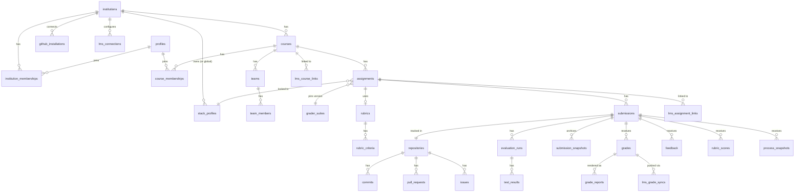

# Data Model (Supabase Postgres)

This is a design sketch. The real schema will live in `supabase/migrations/`.

Conventions:
- Every table has `id uuid primary key default gen_random_uuid()` and
  `created_at timestamptz default now()`, unless shown otherwise.
- RLS is enabled on every table in `public`.
- **Every tenant-owned table has `institution_id uuid not null`**, including child tables. It is
  part of a `unique (institution_id, id)` constraint, so children can use **composite foreign
  keys** `(institution_id, parent_id) references parent (institution_id, id)`. The database
  itself then refuses a row in institution A that points at a parent in institution B.

## 1. Entity overview



## 2. Tables

### Tenancy, identity & access
| Table | Key columns | Notes |
|-------|-------------|-------|
| `institutions` | name, slug unique, status (`active`/`read_only`/`suspended`/`purged`), limits jsonb (max users, runs/day, runner minutes/month, concurrency, storage), settings jsonb (branding, process-policy defaults), contract_started_at, **contract_ended_at**, **purge_after** (= contract_ended_at + 2 years), export_notices jsonb | Created by a super admin. All data is in Singapore, so there's no per-tenant region. |
| `profiles` | `id` = `auth.users.id`, full_name, email, avatar_url, github_user_id bigint unique, github_login, status, anonymised_at | Global (a person can be in several institutions). Created by a trigger on `auth.users` insert. |
| `user_roles` | user_id, role (`super_admin`) | Platform-level role only. |
| `institution_memberships` | institution_id, user_id, role (`admin`/`teacher`/`student`), external_id (student number), status | unique(institution_id, user_id). Read by the Custom Access Token Hook. |
| `invitations` | institution_id, email, github_login, role, course_id, course_role, token_hash, expires_at, accepted_at | |
| `sso_providers` | institution_id, supabase_sso_provider_id, domains text[] | SAML through Supabase SSO. |
| `support_access_grants` | institution_id, granted_to (super admin), granted_by, expires_at, reason | Required for super admins to read tenant data. |

### Courses & teams
| Table | Key columns | Notes |
|-------|-------------|-------|
| `courses` | institution_id, code, name, term, timezone, github_installation_id, archived_at | |
| `course_memberships` | institution_id, course_id, user_id, role (`instructor`/`ta`/`student`), section, source (`manual`/`csv`/`lms`) | unique(course_id, user_id) |
| `teams` / `team_members` | institution_id, course_id, name, github_team_slug / team_id, user_id | |

### Stack profiles, assignments & evaluation config
| Table | Key columns | Notes |
|-------|-------------|-------|
| `stack_profiles` | institution_id **nullable** (null = global), key, version, display_name, definition jsonb (services, datastores, stages, ignore_paths), template_repo, status | Immutable once used; edits create a new version. unique(institution_id, key, version). |
| `institution_stack_profiles` | institution_id, stack_profile_id, enabled | Which global profiles an institution has enabled. |
| `assignments` | institution_id, course_id, slug, title, spec_md, mode (`individual`/`team`), **stack_profile_id**, template_repo, release_at, due_at, late_policy jsonb, triggers jsonb, weights jsonb, **process_policy jsonb**, process_policy_version, run_quota_per_day, grader_suite_id, rubric_id, status (`draft`/`published`/`closed`), grades_released_at, regrade_window_days | Stack profile can't be changed after publishing (trigger-enforced). |
| `extensions` | institution_id, assignment_id, user_id or team_id, due_at, reason, granted_by | Effective deadline = max(due_at, extension). |
| `grader_suites` | institution_id, key, version, git_ref, stack_profile_id (nullable = stack-agnostic), manifest jsonb (tests, titles, hints, weights, categories) | Immutable once published. |
| `rubrics` / `rubric_criteria` | institution_id, title / rubric_id, name, description, max_points, levels jsonb, position | |

### GitHub
| Table | Key columns | Notes |
|-------|-------------|-------|
| `github_installations` | institution_id, installation_id bigint unique, account_login, account_type, permissions jsonb, suspended_at | Maps each installation to exactly one institution. |
| `repositories` | institution_id, github_repo_id bigint unique, installation_id, full_name, default_branch, private, archived, head_sha, head_pushed_at, start_sha | `head_sha`: the default branch head from the latest push (ordered by `pushed_at`); manual test runs test it. `start_sha`: the repository's first commit (the template's), cached the first time staff ask for "changes since the start". |
| `github_events` | institution_id (nullable until resolved), delivery_id text unique, event, action, installation_id, payload jsonb, received_at, processed_at, error | Raw inbox; pruned after 90 days. |
| `commits` | institution_id, repository_id, sha, author_github_id, author_profile_id, co_author_profile_ids uuid[], message, authored_at, pushed_at, additions, deletions, files_changed, branch, **is_meaningful bool**, exclusion_reason | unique(repository_id, sha) |
| `commit_claims` | institution_id, commit_id, claimed_by, status, reviewed_by | Students claiming unattributed commits. |
| `pull_requests` | institution_id, repository_id, number, github_node_id, author_profile_id, title, has_description, linked_issue_numbers int[], state, merged_at, opened_at, closed_at, review_count | |
| `pr_reviews` | institution_id, pull_request_id, reviewer_profile_id, state, submitted_at | |
| `issues` | institution_id, repository_id, number, author_profile_id, title, state, labels text[], opened_at, closed_at | |
| `activity_daily` | institution_id, submission_id, user_id, day, commits, meaningful_commits, additions, deletions, prs_opened, prs_merged, issues_closed | Nightly rollup. |

### Submissions, runs & grading
| Table | Key columns | Notes |
|-------|-------------|-------|
| `submissions` | institution_id, assignment_id, user_id or team_id, repository_id, status (`provisioning`/`active`/`submitted`/`graded`), final_sha | One per student/team per assignment. |
| `evaluation_runs` | institution_id, submission_id, sha, stack_profile_id, grader_suite_id, trigger, status (`queued`/`dispatched`/`running`/`completed`/`failed`/`infra_error`/`cancelled`), gh_workflow_run_id, score, summary jsonb, artifacts_prefix, artifacts_expire_at (null = keep for the institution's retention period), queued_at, started_at, finished_at, requested_by | |
| `test_results` | institution_id, run_id, stage, test_key, title, category, status, weight, duration_ms, expected, actual, message, hint, evidence jsonb, **staff_notes** | `staff_notes` is not granted to `authenticated` (column privileges); course staff read it through `run_staff_notes(run_id)`. `evaluation_runs.callback_token_hash` (local development only) is withheld the same way. |
| `process_snapshots` | institution_id, submission_id, user_id, computed_at, policy_version, score, breakdown jsonb, is_final | Frozen at the deadline; recomputed while the assignment is open. |
| `feedback` | institution_id, submission_id, author_id, body_md, file_path, line, sha, github_comment_id, released | |
| `review_comments` | institution_id, submission_id, sha, path, line, body, author_id | Inline code-review comments (FR-6.2). Course staff write them (the author is set from the session) and edit or delete their own; the student reads them once the grade is released (`grade_visible`). |
| `rubric_scores` | institution_id, submission_id, criterion_id, points, comment, scored_by | unique(submission_id, criterion_id) |
| `grades` | institution_id, submission_id, user_id, version int, evaluation_run_id, components jsonb (per component score/weight/points, what is still pending, raw), late_days, late_penalty, computed_score, override_score, override_reason, final_score, complete, is_current, released_at, created_by | **Append-only**; a new version only when something changed; one `is_current` per submission. Students see released versions only; `override_reason` is not granted to them (staff read it through `grade_override_reasons()`). |
| `submission_overview` (view) | one row per submission: latest finished run, last activity, current grade | `security_invoker`: every underlying table's RLS and column privileges apply. Feeds dashboards, history and the CSV export. |
| `regrade_requests` | institution_id, submission_id, requested_by, message, status (`open`/`accepted`/`declined`/`withdrawn`), response, resolved_by, resolved_at | FR-6.7. Through the API only: the student asks after release, within the assignment's `regrade_window_days` (default 7; 0 = off), one open request at a time; course staff answer with a response (accepting doesn't change the grade by itself: staff adjust the rubric or override, which makes a new released version). Staff and the student are notified. |

### Records (kept for the contract + 2 years)
| Table | Key columns | Notes |
|-------|-------------|-------|
| `submission_snapshots` | institution_id, submission_id, run_id, sha, bundle_path, bundle_sha256, bundle_size, tarball_path, tarball_sha256, tarball_size | `unique(submission_id, sha)`. No writes through the Data API; deletion only through the retention/erasure workflow. (`replicated_at` comes with external replication.) |
| `grade_reports` | institution_id, submission_id, grade_id (unique), user_id, version, grade_version, json_path, pdf_path, sha256, pdf_sha256, generated_at | Immutable; one per released grade version. Students see reports of released versions; Storage objects are readable exactly when the row is. |
| `retention_actions` | institution_id, subject_user_id (nullable for an institution-wide purge), action (`anonymise`/`delete`/`export`/`purge`), requested_by, approved_by, executed_at, scope jsonb, certificate jsonb | Audit of erasure, export and purge handling. |

### LMS
| Table | Key columns | Notes |
|-------|-------------|-------|
| `lms_connections` | institution_id, type (`canvas`/`moodle`/`google_classroom`), name, issuer, client_id, deployment_ids text[], auth_login_url, auth_token_url, jwks_url, oauth_secrets_encrypted bytea, status | LTI 1.3 platform details or Google OAuth config. |
| `lms_user_links` | institution_id, lms_connection_id, lms_user_id, profile_id, matched_by (`email`/`admin`/`launch`) | unique(lms_connection_id, lms_user_id) |
| `lms_course_links` | institution_id, course_id, lms_connection_id, lms_course_id, context_id, nrps_url | |
| `lms_assignment_links` | institution_id, assignment_id, lms_course_link_id, lineitem_url or classroom_coursework_id, score_maximum | |
| `lms_grade_syncs` | institution_id, grade_id, grade_version, lms_assignment_link_id, status (`pending`/`synced`/`failed`/`conflict`), attempts, last_error, lms_response jsonb, synced_at | unique(grade_id, grade_version, lms_assignment_link_id), which makes syncs idempotent. |

### Platform
| Table | Key columns | Notes |
|-------|-------------|-------|
| `notifications` | institution_id, user_id, type (`run_finished`/`grade_released`/`deadline_soon`/`extension_granted`/`regrade_requested`/`regrade_answered`), title, body, link, dedupe_key, read_at | Written by the platform (an extension trigger writes its own); users read their own and may only set `read_at`. `unique(user_id, dedupe_key)` makes retries harmless. |
| `institution_settings` / `platform_settings` | key, value jsonb, updated_by | Per tenant / global. |
| `audit_logs` | institution_id (nullable for platform actions), actor_id, action, entity, entity_id, before jsonb, after jsonb, ip, at | Append-only. |
| `usage_counters` | institution_id, period (month), runs, runner_minutes, storage_bytes | The platform pays for compute; these drive quotas and plan limits. |
| `pgboss.*` | (managed by pg-boss) | Job queue and schedules, in their own schema; not exposed through the API. |

## 3. RLS pattern

Implemented in `supabase/migrations/20261008000001_tenancy_core.sql`. Policy helpers live in a
`private` schema (not exposed through the Data API), are `SECURITY DEFINER`, and read
memberships from the **database**, never from JWT claims, so removing or demoting a member takes
effect immediately ([ADR 0012](adr/0012-authorisation-reads-database.md)).

```sql
-- Institutions where the caller is an active member and the institution is usable
create function private.my_institution_ids() returns uuid[]
language sql stable security definer set search_path = '' as $$
  select coalesce(array_agg(m.institution_id), '{}')
  from public.institution_memberships m
  join public.institutions i on i.id = m.institution_id
  where m.user_id = (select auth.uid()) and m.status = 'active'
    and i.status in ('active', 'read_only');
$$;

-- Also: private.is_super_admin(), private.has_institution_role(iid, roles[]),
--       private.has_course_role(cid, roles[]), private.institution_is_writable(iid)

create policy courses_select on public.courses for select to authenticated
  using (
    private.has_institution_role(institution_id, '{admin,teacher}')
    or private.has_course_role(id, '{instructor,ta,student}')
  );

create policy courses_insert on public.courses for insert to authenticated
  with check (private.has_institution_role(institution_id, '{admin,teacher}')
              and private.institution_is_writable(institution_id));
```

Rules of thumb:
- Super admins see platform data (institutions, installations) but **not** tenant data such as
  memberships or courses; that will need an audited support-access grant.
- Suspended institutions are invisible to their members; read-only ones accept no writes.
- Server code connects as the table owner and bypasses RLS, so it authorises through
  `packages/core` and always filters by `institution_id`.

Tenant isolation is tested with pgTAP (`supabase/tests/database`). Two institutions are seeded,
and for every role the tests assert that nothing from the other institution is visible.
`tests.visible_rows()` lists every tenant-owned table, and a guard test fails if a new table with
`institution_id` is not added to it.

## 4. Indexes worth having from day one

- `(institution_id, …)` leading every list-style index, e.g. `submissions (institution_id, assignment_id)`
- `commits (repository_id, authored_at desc)`, `commits (author_profile_id, authored_at)`
- `evaluation_runs (submission_id, queued_at desc)`, partial index `where status in ('queued','dispatched','running')`
- `grades (institution_id, user_id) where is_current`; `grade_reports (grade_id, version desc)`
- `lms_grade_syncs (status) where status in ('pending','failed')`
- `github_events (processed_at) where processed_at is null`
- `notifications (user_id) where read_at is null`
- every foreign key column (Supabase's linter flags missing ones)
- Records grow without limit. Consider partitioning `test_results` and `commits` by year once
  they pass about 50 M rows.
