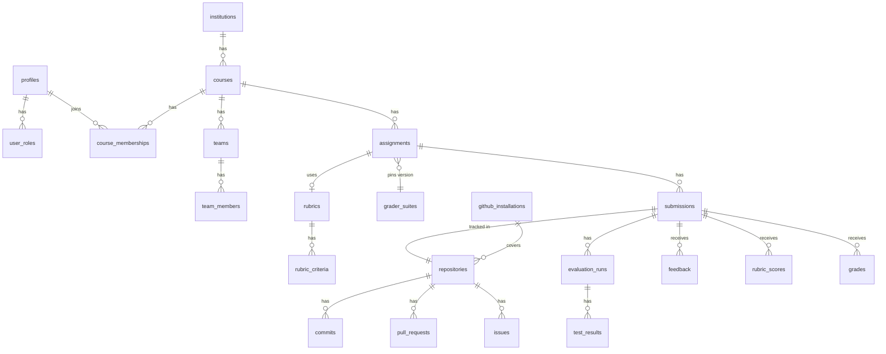

# Data Model (Supabase Postgres)

This is a design sketch. The real schema will live in `supabase/migrations/`. All tables have
`id uuid primary key default gen_random_uuid()` and `created_at timestamptz default now()`
unless shown otherwise, and RLS is enabled on every table in `public`.

## 1. Entity overview



## 2. Tables

### Identity & access
| Table | Key columns | Notes |
|-------|-------------|-------|
| `institutions` | name, slug, settings jsonb | One row if single-tenant. |
| `profiles` | `id` = `auth.users.id`, full_name, email, avatar_url, github_user_id bigint unique, github_login, status (`active`/`deactivated`), institution_id | Created by a trigger on `auth.users` insert. |
| `user_roles` | user_id, role (`admin`/`teacher`/`student`) | Platform role; read by the Custom Access Token Hook. |
| `invitations` | email, github_login, role, course_id, course_role, token_hash, expires_at, accepted_at | Matched on first login. |

### Courses & teams
| Table | Key columns | Notes |
|-------|-------------|-------|
| `courses` | institution_id, code, name, term, timezone, github_org, archived_at | |
| `course_memberships` | course_id, user_id, role (`instructor`/`ta`/`student`), section | unique(course_id, user_id) |
| `teams` | course_id, name, github_team_slug | |
| `team_members` | team_id, user_id | |

### Assignments & evaluation config
| Table | Key columns | Notes |
|-------|-------------|-------|
| `assignments` | course_id, slug, title, spec_md, mode (`individual`/`team`), template_repo, contract jsonb, release_at, due_at, late_policy jsonb, triggers jsonb, weights jsonb, run_quota_per_day, grader_suite_id, rubric_id, status (`draft`/`published`/`closed`), grades_released_at | |
| `extensions` | assignment_id, user_id or team_id, due_at, reason, granted_by | Effective deadline = max(due_at, extension). |
| `grader_suites` | key, version, git_ref, manifest jsonb (tests, weights, visibility) | Immutable once published. |
| `rubrics` / `rubric_criteria` | title / rubric_id, name, description, max_points, levels jsonb, position | |

### GitHub
| Table | Key columns | Notes |
|-------|-------------|-------|
| `github_installations` | installation_id bigint unique, account_login, account_type, permissions jsonb, suspended_at | |
| `repositories` | github_repo_id bigint unique, installation_id, full_name, default_branch, private, archived | |
| `github_events` | delivery_id text unique, event, action, repository_id, payload jsonb, received_at, processed_at, error | Raw inbox; pruned after 90 days. |
| `commits` | repository_id, sha, author_github_id, author_profile_id, message, authored_at, pushed_at, additions, deletions, files_changed, branch | unique(repository_id, sha) |
| `pull_requests` | repository_id, number, github_node_id, author_profile_id, title, state, merged_at, opened_at, closed_at, review_count | |
| `pr_reviews` | pull_request_id, reviewer_profile_id, state, submitted_at | |
| `issues` | repository_id, number, author_profile_id, title, state, labels text[], opened_at, closed_at | |
| `activity_daily` | submission_id, user_id, day, commits, additions, deletions, prs_opened, prs_merged, issues_closed | Nightly rollup; drives dashboards. |

### Submissions, runs & grading
| Table | Key columns | Notes |
|-------|-------------|-------|
| `submissions` | assignment_id, user_id or team_id, repository_id, status (`provisioning`/`active`/`submitted`/`graded`), final_sha | One per student/team per assignment. |
| `evaluation_runs` | submission_id, sha, grader_suite_id, trigger (`push`/`pr`/`manual`/`deadline`/`regrade`), status (`queued`/`dispatched`/`running`/`completed`/`failed`/`infra_error`/`cancelled`), gh_workflow_run_id, score numeric, summary jsonb, artifacts_prefix, queued_at, started_at, finished_at, requested_by | |
| `test_results` | run_id, stage, test_key, status, weight, duration_ms, message, visibility (`visible`/`hidden`) | |
| `feedback` | submission_id, author_id, body_md, file_path, line, sha, github_comment_id, released | |
| `rubric_scores` | submission_id, criterion_id, points, comment, scored_by | unique(submission_id, criterion_id) |
| `grades` | submission_id, evaluation_run_id, components jsonb, late_penalty, computed_score, override_score, override_reason, is_current, released_at | Append-only; only one `is_current` row per submission. |
| `regrade_requests` | submission_id, requested_by, message, status, resolved_by, resolution | |

### Platform
| Table | Key columns | Notes |
|-------|-------------|-------|
| `notifications` | user_id, type, payload jsonb, read_at | Realtime-subscribed. |
| `platform_settings` | key text pk, value jsonb, updated_by | Admin-only. |
| `audit_logs` | actor_id, action, entity, entity_id, before jsonb, after jsonb, ip, at | Append-only (no UPDATE/DELETE grants). |

## 3. RLS pattern

```sql
-- Helper functions (SECURITY DEFINER avoids recursive RLS on course_memberships)
create function public.is_admin() returns boolean
language sql stable security definer set search_path = '' as $$
  select exists (select 1 from public.user_roles
                 where user_id = (select auth.uid()) and role = 'admin');
$$;

create function public.is_course_staff(cid uuid) returns boolean
language sql stable security definer set search_path = '' as $$
  select exists (select 1 from public.course_memberships
                 where course_id = cid and user_id = (select auth.uid())
                   and role in ('instructor','ta'));
$$;

create function public.owns_submission(sid uuid) returns boolean
language sql stable security definer set search_path = '' as $$
  select exists (
    select 1 from public.submissions s
    left join public.team_members tm on tm.team_id = s.team_id
    where s.id = sid and (s.user_id = (select auth.uid()) or tm.user_id = (select auth.uid())));
$$;

-- Example: evaluation runs
alter table public.evaluation_runs enable row level security;

create policy "students read own runs" on public.evaluation_runs
  for select to authenticated
  using (public.owns_submission(submission_id));

create policy "staff read course runs" on public.evaluation_runs
  for select to authenticated
  using (public.is_course_staff(
           (select a.course_id from public.submissions s
            join public.assignments a on a.id = s.assignment_id
            where s.id = submission_id)));

-- No insert/update policies: only the service role (worker) writes runs.

-- Example: grades are visible to students only after release
create policy "students read released grades" on public.grades
  for select to authenticated
  using (released_at is not null and is_current and public.owns_submission(submission_id));
```

Hidden test details: expose `test_results` to students through a **view** (`student_test_results`,
`security_invoker = true`) that masks `message` for `visibility = 'hidden'` rows according to
the suite manifest. Students get no direct grant on the base table.

## 4. Indexes worth having from day one

- `commits (repository_id, authored_at desc)`, `commits (author_profile_id, authored_at)`
- `evaluation_runs (submission_id, queued_at desc)`, partial index `where status in ('queued','dispatched','running')`
- `github_events (processed_at) where processed_at is null`
- `course_memberships (user_id)`, `submissions (assignment_id)`, `notifications (user_id) where read_at is null`
- every foreign key column (Supabase's linter flags missing ones)
